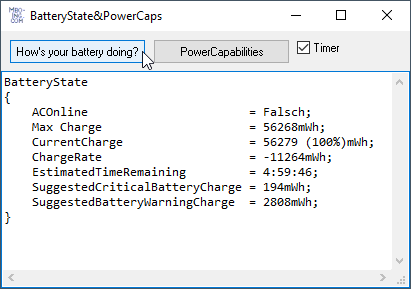
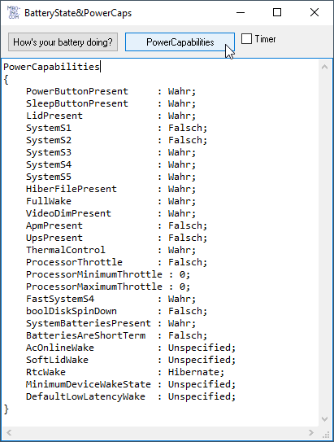

# Syst_BatteryState  
## how to check your batteries state with powrprof.dll
Recently (jan. 2021) I found some interesting win-api functions in WindowsApiCodePack 1.1.4.    
I didn't even know this dll exists. If your program runs on a laptop-computer it can check your battery's state.  
You can do this in your own program by using the class BatteryState.  
The purpose could be, to check the battery before the user performs a long lasting function, 
that maybe could not come to an end before the end of the battery power.
  

